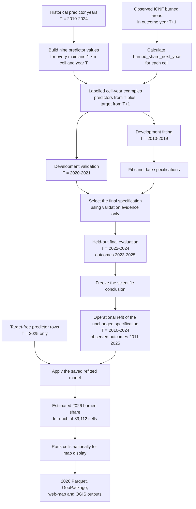

# From historical evidence to the 2026 estimate

This guide explains how the project learns from observed annual wildfire data
and produces the current target-free 2026 estimated burned share. It separates
historical model evaluation from the later operational refit and annual score.
It owns the scientific and temporal explanation; the
[annual operational runbook](operational_forecast_cycle.md) owns commands,
update steps, safeguards, and output paths.

## The complete flow



## What one learning example contains

One labelled example represents one mainland Portugal 1 km cell in predictor
year `T`:

- nine predictor values derived only from information assigned to `T` or
  earlier under the documented source-year rules; and
- the observed target `burned_share_next_year`, calculated from ICNF burned
  areas in `T+1`.

For example, a `T=2024` learning row contains 2024 predictor inputs and the
burned share observed in 2025. It does not use the 2025 outcome as a predictor.

The observed target is:

```text
burned_share_next_year
    = area of the cell's land burned in T+1
      / total mainland-land area of the cell
```

Before intersection, the annual ICNF burned-area polygons are repaired under
the documented derived-data policy and dissolved by year. Dissolving prevents
overlapping fire polygons from double-counting burned land within a cell.

## What the model learns

The final model is a nine-feature, two-stage histogram-gradient-boosting
regression. The two stages address the target's large number of exact zeros:

1. a `HistGradientBoostingClassifier` estimates the probability that the cell
   has any burned area in `T+1`; and
2. a `HistGradientBoostingRegressor`, trained on positive-target rows, estimates
   the burned share conditional on burning occurring.

The final continuous estimate is:

```text
estimated burned share
    = estimated probability of any burning
      x estimated burned share if burning occurs
```

This result is a proportion from 0 to 1. Multiplying it by 100 gives the
estimated percentage of the cell's mainland-land area that may burn. It is not
the probability that the whole cell will burn.

Illustrative calculation only:

```text
0.25 estimated probability of any burning
x 0.045 estimated burned share if burning occurs
= 0.01125 estimated burned share
= 1.125% of the cell's land area
```

## Why model selection, testing, and refitting are separate

| Stage | Predictor years | Outcome years | What happens |
|---|---:|---:|---|
| Development fitting | 2010-2019 | 2011-2020 | Candidate specifications learn from labelled examples. |
| Development validation | 2020-2021 | 2021-2022 | The final specification is selected without reading final-test rows. |
| Held-out final evaluation | 2022-2024 | 2023-2025 | The frozen specification is evaluated once on later years. |
| Operational refit | 2010-2024 | 2011-2025 | The unchanged selected specification learns from all completed labelled evidence. |
| Current annual scoring | 2025 | 2026 not yet observed | The refitted model estimates 2026 burned share from target-free 2025 inputs. |

The operational refit does not repeat model selection or change the validated
specification. It lets the already selected method learn from the most recent
completed outcomes before estimating the next unobserved year.

## How the 2026 estimate is produced

For every canonical 1 km cell, the pipeline builds a target-free `T=2025`
feature row. Its historical-fire predictor uses burned years 2015-2024 only,
and its climate predictors use JJAS 2025 only. No observed 2026 burned-area data
is present or required.

The saved operational model converts those nine predictors into
`predicted_burned_share_next_year`. The output therefore means:

> the model-estimated proportion of that cell's mainland-land area that may
> burn in 2026, based on the validated historical relationships and available
> 2025 inputs.

The estimate is then ranked against the estimates for all 89,112 mainland
cells. `predicted_exposure_percentile` records that national relative rank.
Map colour groups are derived from this rank for easier comparison; they do not
change the continuous model estimate and are not physical risk thresholds.

For example, an estimated burned share of `1.13%` can have a national rank near
the 75th percentile. These values answer different questions:

- `1.13%` is the model's continuous estimate for that cell; and
- the 75th percentile means its estimate is higher than approximately 75% of
  mainland cells in the same 2026 scoring run.

## Correct interpretation

The 2026 output is a target-free comparative estimate. It is not an observed
2026 burned-area measurement, a property-level forecast, a safety guarantee, or
a buy/do-not-buy recommendation. Its predictive performance can be evaluated
independently only after ICNF publishes the observed 2026 burned-area outcome.

For the exact feature definitions and annual rebuilding procedure, see the
[data dictionary](data_dictionary.md), the
[model-selection record](model_v2_validation_selection.md), and the
[annual operational runbook](operational_forecast_cycle.md).
